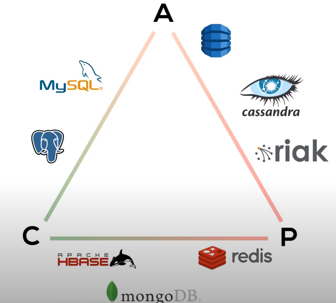

# System Design

> Note: **Black Tank System** aka **"BTS"** will be used throughout the doc to represent the system to be designed.

## Strategy

### 1. Clarifying Requirements

#### Functional

1. What does BTS do ? How do users interact with BTS ?
    - WHO: 
        - UI (user)
        - API (other services)

    - WHAT-in: ```input```
    - WHAT-out: ```output```

    - WHAT-config: initial ```config``` (set by user)

    - WHAT-act: triggering event (user)
    - WHAT-react: handling event (BTS)

    - WHAT-self: self-looping event

#### Non-functional 

1. CAP theorem
    - Consistency
    - Availability
    - Partition tolerance (network failure)
    
1. Reliability
    - success rate
        - \> 99%
    - failure tolerance
        - allowable
        - unallowable
1. Scalability
    - throughput (vertical)
    - geo-scalable (horizontal)
1. Performance
    - latency per process
        - real-time (streaming)
        - batch
    - latency over a period

#### Additional

1. Monitoring (health)
1. Reporting (analytics)


### 2. Profiling System 

#### Pattern

1. Read-write ratio

#### Capacity

1. Network (Traffic)
    - Outgoing - Read per sec (#/s)
        - **bandwidth (bytes/s)** = #/s * bytes/#
    - Incoming - Write per sec (#/s)
        - **bandwidth (bytes/s)** = #/s * bytes/#
1. Storage
    - Object size (bytes/#)
    - New objects per sec (#/day)
    - Storing period (day)
1. Memory (Cache)
    - 80-20 rule
        - 20% of objects ~= 80% of traffic
    - cache 20% of objects (per day)
        - duplicate records makes necessary memory less

### Interfacing System

1. System API
    - functional requirements
        - ```doSomethingAPI(user_api_key, config, input) => output```
    - abuse prevention
        - ```user_api_key```
            - limited lifespan
            - limited No. of reqs

### Database Design

#### Database technology

1. Optimized for storage (SQL)
    - normalized/relational
    - ad-hoc/dynamic queries
    - scale vertical (multiple tables)
    - good for OLAP (online analytical processing)
    - correct (validity)
    - ACID
        - Atomicity
        - Consistency
        - Isolation
        - Durability
1. Optimized for compute (NoSQL)
    - de-normalized/hierarchical
    - instantiated views
    - scale horizontally
    - best for OLTP at scale (online transactional processing)
    - fast
    - BASE
        - Basically Available
        - Soft state
        - Eventually consistent